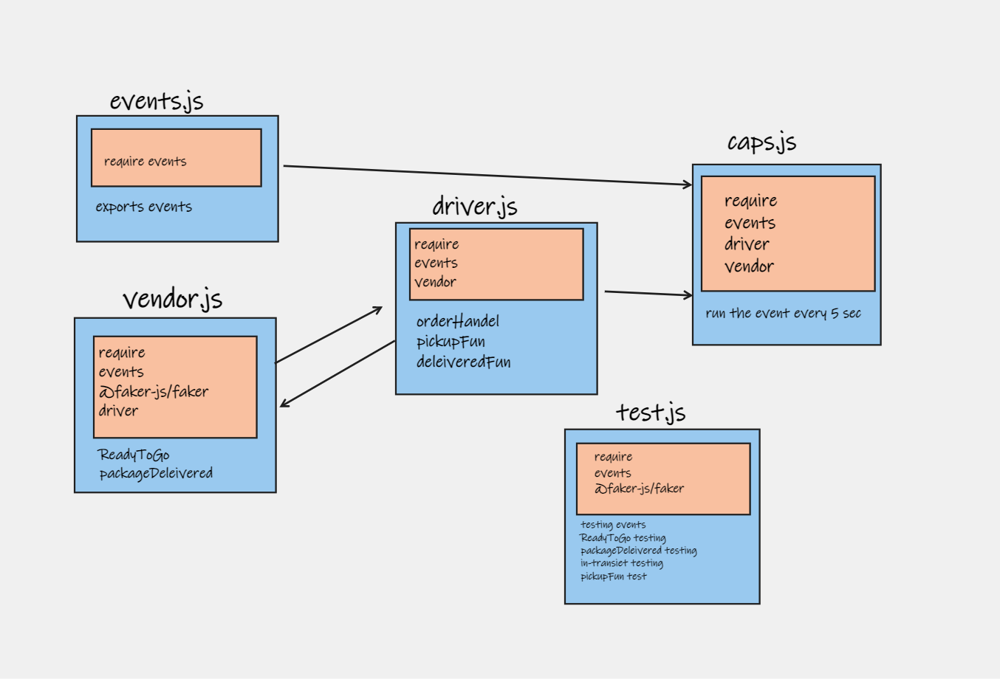
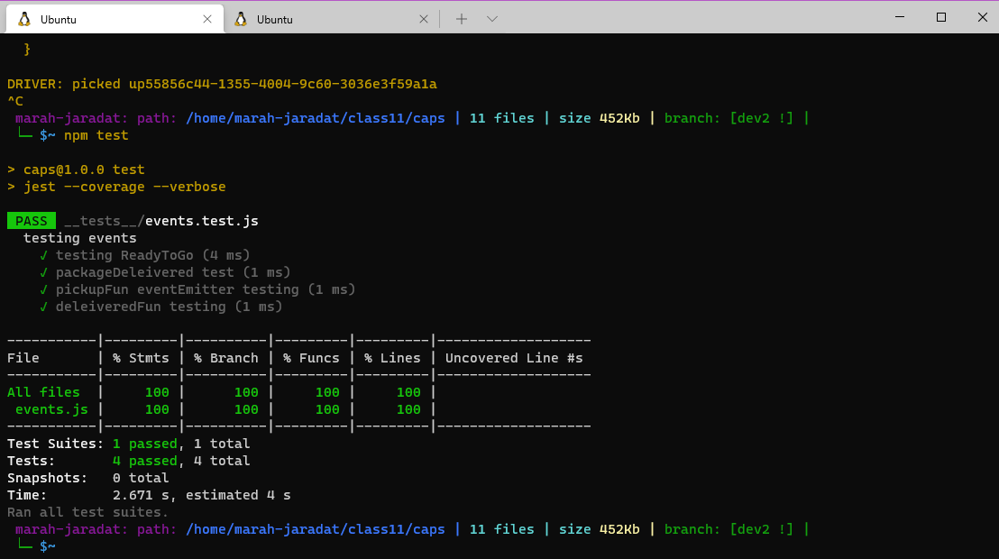
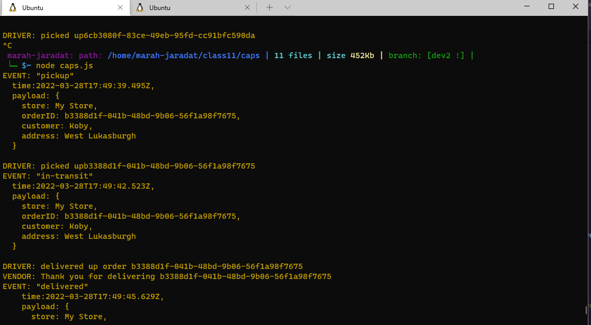

# caps
This will be an event driven application that “distributes” the responsibility for logging to separate modules, using only events to trigger logging based on activity.

## UML diagram

## npm test

## the output

## **here are the links for the server:**

**1. The Actions link:**
   [Actions](https://github.com/marah-jaradat/caps/actions)

**2. The Pull request:**
   [pull request](https://github.com/marah-jaradat/caps/pull/4)

